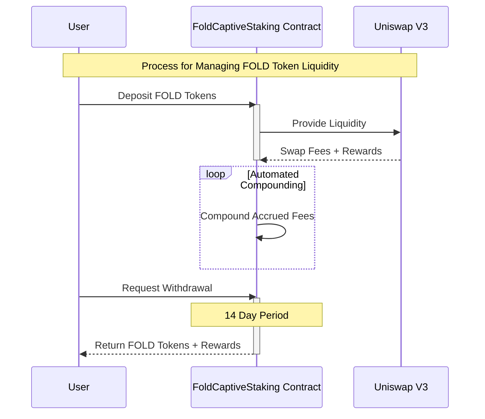
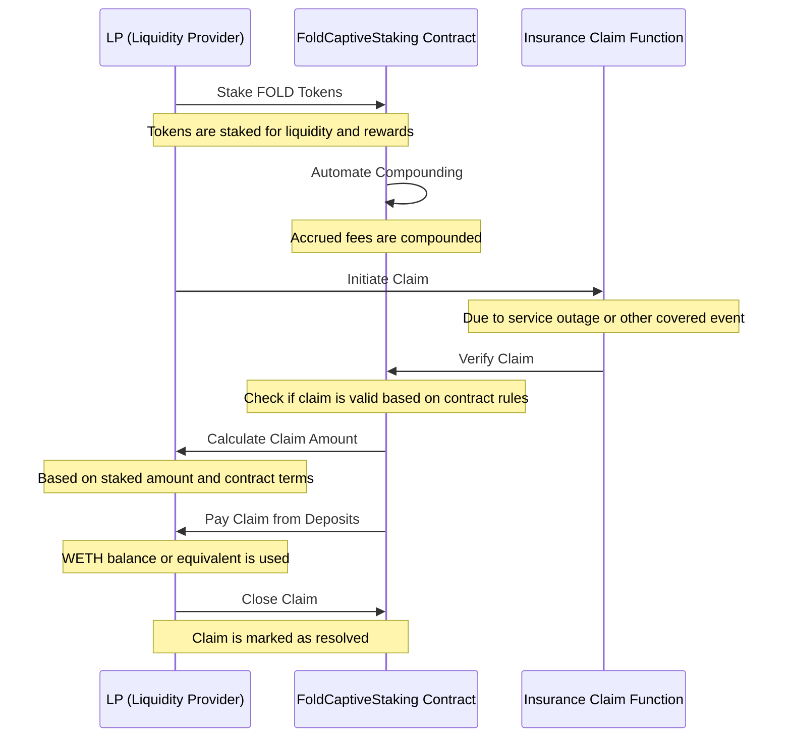

# [`FOLD` Staking Protocol v02](#)

<!-- TOC start -->

- [Captive Insurance](#captive-insurance)
      + [Funding ](#funding)
      + [Coverage](#coverage)
   * [Underwriting Stakers](#underwriting-stakers)
      + [Staking Mechanism](#staking-mechanism)
         - [Primary Incentives](#primary-incentives)
         - [Secondary Incentives:](#secondary-incentives)
         - [Deposit Structure](#deposit-structure)
         - [Withdrawal Process:](#withdrawal-process)
      + [Reward Calculation](#reward-calculation)
      + [Depositor Autonomy](#depositor-autonomy)
      + [Fee Handling](#fee-handling)
      + [Comparison with Bunni](#comparison-with-bunni)
   * [High level overview](#high-level-overview)
   * [Claims Process](#claims-process)

<!-- TOC end -->

<!-- TOC --><a name="captive-insurance"></a>
## Captive Insurance

Captive insurance is a form of self-insurance where an entity creates a *wholly-owned subsidiary* to provide insurance for itself. This subsidiary, known as a "**captive insurer**," _underwrites the risk of its parent company_. Captive insurance allows the parent company to retain premiums and control the risk management process.

Due to the underlying nature of the risk, typical insurance/re-insurance carriers will not provide coverage for this type of risk.

> [!IMPORTANT]
> Please read the https://forums.manifoldfinance.com/t/captive-insurance-and-fold-staking/562 forum post for more information regarding the motivations behind this mechanism.

<!-- TOC --><a name="funding"></a>
### Funding 
* The parent entity provides capital to the captive insurer.
* The captive insurer collects premiums from the parent entity.

<!-- TOC --><a name="coverage"></a>
### Coverage
* The captive insurer provides coverage for the parent entity's risks.
* Claims are processed and paid by the captive insurer.

> [!NOTE]
> [Disclaimer: No Financial Advice](https://github.com/manifoldfinance/legal/blob/master/active/disclaimer/DISCLAIMER_NO_FINANCIAL_ADVICE.txt) and [Content is presented for eductional purposes only.](https://github.com/manifoldfinance/legal/blob/master/active/disclaimer/CONTENT_DISCLAIMER.txt)

> [!CAUTION]
> Disclaimer: This is not a regulated insurance product. This is a self-insurance mechanism that is designed to provide coverage for the risks associated with the Manifold Finance Relay and XGA Auction Platform.

<!-- TOC --><a name="underwriting-stakers"></a>
## Underwriting Stakers

Depositing into the `FoldCaptiveStaking` contract enables you to underwrite the risk of missing out on blocks due to service outages of the Manifold Finance Relay. This provides a financial safety net for validators connected to the Manifold Finance Relay.
The Relay provides Validators connected to it unique MEV opportuinities via the XGA Auction. *[Read more about the Auction at docs.xga.com](https://docs.xga.com)*. If the relay experiences an outage, Manifold Finance covers the cost of lost opportunities for validators that participate.

<!-- TOC --><a name="staking-mechanism"></a>
### Staking Mechanism
Staking `$FOLD` tokens transfers LP deposit ownership to the *FOLDstaking* contract. The contract owners can claim `$FOLD` balances permanently for insurance claims through the `claimInsurance` function.

> [!IMPORTANT]
> Fees earned are retained into a indemnity fund that first pays out. In the event that the losses exceed the assets in the fund, it is only then that a claim can be made against the Vault.

<!-- TOC --><a name="primary-incentives"></a>
#### Primary Incentives
By underwriting the service risk of the Manifold Finance Relay and XGA Auction Platform, stakers earn yield in `$ETH`. `$FOLD` is *not* the reward token paid to stakers.

<!-- TOC --><a name="secondary-incentives"></a>
#### Secondary Incentives:
LPs receive rewards for staking, which includes swap fees and automated compounding of accrued fees. This incentivizes optimal compounding times concerning gas costs. 

<!-- TOC --><a name="deposit-structure"></a>
#### Deposit Structure
Multiple V3 positions can be deposited. The reward amount is determined by the duration and share of the total liquidity deposited in the vault, paid from the contract's WETH balance.

<!-- TOC --><a name="withdrawal-process"></a>
#### Withdrawal Process:
Withdrawals, after initiation, are pro-rated over 14 days if they exceed a certain percentage of the pool's total liquidity.


<!-- TOC --><a name="reward-calculation"></a>
### Reward Calculation

Rewards are calculated without considering the entire stake duration, instead looping through each week. Claiming rewards or removing liquidity resets the deposit's timestamp, reducing total rewards. 

The reward calculation formula is as follows:

```
(position stake / total staked) x (stake duration / average stake duration)
```


> [!NOTE] 
> The Average stake duration is factored in, following the "sunshine & rainbow" design doc from *Pangolin Exchange's SAR Mechanism*.[see docs.pangolin.exchange/faqs/understanding-sar](https://docs.pangolin.exchange/faqs/understanding-sar)

<!-- TOC --><a name="depositor-autonomy"></a>
### Depositor Autonomy
Depositors can choose the price range (ticks) for their UNIv3 NFT by creating it externally and calling the deposit function with DepositParams. A vote affects deposits of stakers with no personal preference, using a time-weighted median for the price range.

<!-- TOC --><a name="fee-handling"></a>
### Fee Handling
Uniswap automatically handles fee collection and redepositing, enhancing LP earnings. Bunni's compound function increases the value of share tokens, while FOLDstaking.sol rewards are based on deposit duration and total size across all price ranges.

<!-- TOC --><a name="comparison-with-bunni"></a>
### Comparison with Bunni
Bunni pays rewards pro rata to the contribution per price range, while FOLDstaking.sol pays rewards based on deposit duration and total size relative to the pool's total liquidity across all price ranges. 

> We thank [@ZeframLou](https://github.com/ZeframLou) for his tireless work on improving mechanism design in the industry.

<!-- TOC --><a name="high-level-overview"></a>
## High level overview




<!-- TOC --><a name="claims-process"></a>
## Claims Process

> [!WARNING]
> Track the GitHub issue at https://github.com/manifoldfinance/fold-staking/issues/9

Currently, `claimInsurance` does not have the logic necessary to 'validate' a claim. This is because the management of captive insurance claims is handled by us, which is why it is called Captive Insurance.

Until the L2 Construct is implemented for v2 supporting multiple relays, this is fine. However, we should outline and document how exactly a claim is substantiated. Typically, the insured party must provide notice to their insurance carrier for potential claims. Therefore, it is up to the underlying LST/Validator/Node Operator to initiate this process, it is not up to us to initialize the process for paying out a claim.



## License

<!-- START OF DISCLAIMER -->
Copyright © 2021-2024 Manifold Finance, Inc.

All Rights Reserved - email: contact@manifoldfinance.com

This software or document includes material from Manifold Finance.

    THIS DOCUMENT IS PROVIDED "AS IS," AND COPYRIGHT HOLDERS MAKE NO
    REPRESENTATIONS OR WARRANTIES, EXPRESS OR IMPLIED, INCLUDING, BUT NOT LIMITED
    TO, WARRANTIES OF MERCHANTABILITY, FITNESS FOR A PARTICULAR PURPOSE,
    NON-INFRINGEMENT, OR TITLE; THAT THE CONTENTS OF THE DOCUMENT ARE SUITABLE FOR
    ANY PURPOSE; NOR THAT THE IMPLEMENTATION OF SUCH CONTENTS WILL NOT INFRINGE
    ANY THIRD PARTY PATENTS, COPYRIGHTS, TRADEMARKS OR OTHER RIGHTS.

    COPYRIGHT HOLDERS WILL NOT BE LIABLE FOR ANY DIRECT, INDIRECT, SPECIAL OR
    CONSEQUENTIAL DAMAGES ARISING OUT OF ANY USE OF THE DOCUMENT OR THE
    PERFORMANCE OR IMPLEMENTATION OF THE CONTENTS THEREOF.

The name and trademarks of copyright holders may NOT be used in advertising or
publicity pertaining to this document or its contents without specific,
written prior permission. Title to copyright in this document will at all
times remain with copyright holders.

<!-- END OF DISCLAIMER -->
